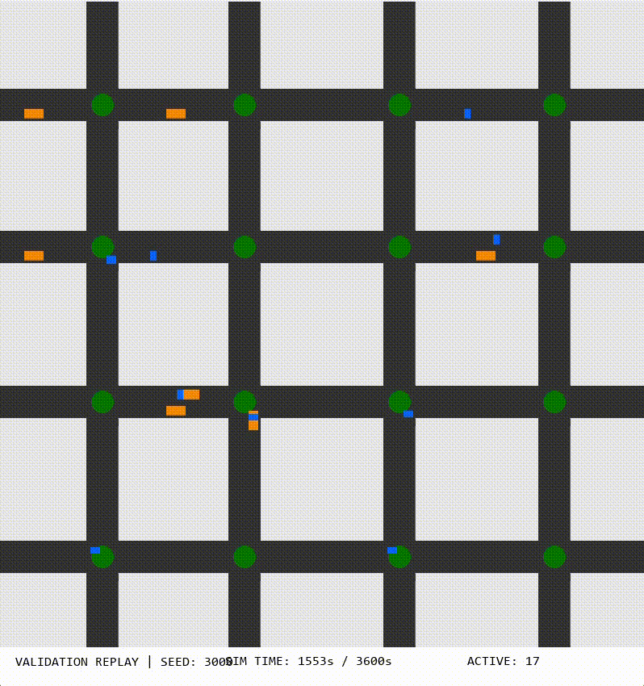

# Evolutionary optimization of traffic signal timing

**CISC 455 / 851**. This repository trains an evolutionary algorithm (EA) to set per-intersection traffic light parameters on a continuous **N×N** road grid with bidirectional traffic, car-following physics, and goal-directed vehicles routed with **A\***.



## Overview

Urban signal timing is usually hand-tuned or fixed to a simple pattern. Here, each intersection’s timing policy is **evolved**: the simulator scores how well vehicles move through the network, and the EA searches for better combinations of green times and phase offsets. The goal is to reduce wasted time at red lights while respecting mandatory yellow and all-red clearance intervals so the optimizer cannot invent unsafe transitions.

The active codebase is Python scripts (`ArrayBasedTraining.py`, `ArrayValidation.py`, `ArrayReplay.py`, `routing.py`). Legacy Jupyter notebooks are kept under `LegacyExplorationNotebooks/` for reference only.

---

## Simulation model

**Road geometry.** The map spans `[0, MAP_END]` metres on each axis (default 1000 m). Horizontal roads lie at fixed **y** coordinates `INTERSECTIONS_H`; vertical roads at **x** coordinates `INTERSECTIONS_V`. The two lists differ on purpose so segment lengths are **not symmetric**: the network is harder to exploit with a single repeated timing pattern.

**Array-based traffic.** Each lane on each road segment is a 1D array of integer cell states (empty or occupied by a vehicle id). Vehicles advance in discrete one-second steps with acceleration limits and a safety buffer to the vehicle ahead. Red lights cap movement at stop lines. This representation makes dense traffic and queues explicit compared to a purely abstract “delay per link” model.

**Signal encoding.** A repeating cycle uses integer phases: north–south green, yellow, east–west green, yellow, with fixed **6 s** yellow and **3 s** all-red after each green so every legal chromosome includes the same safety margins.

**Demand.** Vehicles are injected using repeated random spawn attempts per simulated second (steady-state load). A fraction of spawns are **goal cars**: they appear in the interior and follow a shortest-path route on the intersection graph where edge cost is **physical road length** in metres (`routing.py`).

---

## Evolutionary algorithm

**Genotype and phenotype.** The **genotype** is the list of tunable parameters. Each intersection stores `IntersectionTiming(g_ns, g_ew, offset)`: north–south green duration, east–west green duration, and a **phase offset** (seconds) that shifts where that intersection sits inside its cycle relative to others. The **phenotype** seen by the simulator is the resulting per-second light state over a one-hour evaluation horizon, built by repeating the fixed yellow/all-red template and applying the offset.

**Fitness.** The EA **minimizes** aggregate cost over all vehicles spawned in the evaluation run. The score weights **idling** more than raw travel time (idling is multiplied by two) so solutions that keep traffic moving at green are preferred over those that allow long stationary queues. Vehicles that do not finish their trip within the horizon receive a penalty so early generations still receive a usable gradient when completion rates are low.

**Baseline.** Validation compares the evolved individual to a **uniform baseline**: every intersection uses the same 30 s north–south / 30 s east–west pattern with **zero** offset. That isolates the benefit of differentiated timings and coordination (offsets) from simply “having a reasonable cycle.”

**Variation operators.** **Tournament selection** (`TOURNAMENT_K`) picks parents with pressure that is strong enough to improve but mild enough to preserve diversity. **Crossover** swaps entire `IntersectionTiming` objects between parents so yellow and all-red segments are never cut in the middle. **Mutation** randomly perturbs green times and/or offsets. **Elitism** copies the best individual into the next generation. Evaluations can run **in parallel** across CPU cores (`ArrayBasedTraining.py` CLI).

Default population size, generation count, and rates are defined at the top of `ArrayBasedTraining.py` and can be adjusted there or via supported command-line arguments.

---

## Running the project

Install dependencies (Pygame is only required for the visual replay):

```bash
pip install numpy matplotlib pygame
```

Train a new run (writes `runs/<timestamp>/best_timing_array.pkl`, updates `runs/latest_run.txt`, and logs to that folder):

```bash
python ArrayBasedTraining.py
```

Validate a saved chromosome (replays evolved vs baseline under the same stochastic traffic seed, prints metrics, saves figures, and opens plot windows as implemented in the script):

```bash
python ArrayValidation.py --pkl runs/<timestamp>/best_timing_array.pkl
```

Visual replay (lighter traffic than training for clarity):

```bash
python ArrayReplay.py --pkl runs/<timestamp>/best_timing_array.pkl
```

---

## Outputs and how to read them

Artifacts are written next to the pickle you pass to validation (or under the latest run directory after training). Typical files:

| File | Meaning |
|------|--------|
| `plot_phase_sequence.png` | First 20 minutes of light phases per intersection: evolved vs baseline stacked. |
| `plot_vehicle_breakdown.png` | Mean travel time (finished vehicles) and mean idling (all spawned), by vehicle type. |
| `plot_finish_rate.png` | Percentage of spawned vehicles that complete their trip within the hour. |
| `plot_density.png` | Count of active vehicles each second (congestion / load proxy) with linear trend lines. |
| `plot_road_timing_correlation.png` | Exploratory scatter: local mean segment length vs evolved `g_ns`, `g_ew`, and offset, with Pearson **r**. |

The console prints a **normalized fitness** value for evolved and baseline replays and the difference between them. Any single run depends on seeds, spawn parameters, and EA settings; treat numbers as **illustrative** unless you average over repeated experiments.

**Example.** For one validation run on `runs/2026-03-22_032423/best_timing_array.pkl`, evolved timings achieved lower normalized fitness than the uniform baseline (approximately **153 vs 180**, where lower is better), with high finish rates for goal-directed vehicles. Correlation between local road length and evolved greens was **weak** (Pearson **r** on the order of **0.2** for north–south green and near zero for other pairings), which is expected when only **16** intersections contribute one point each and timings are co-adapted across the whole network.

### Road length versus signal parameters

For each intersection grid cell, **local geometry** is summarized as the mean length of the **four** road segments that meet at that junction (derived from `SEGMENT_LENGTHS_H` and `SEGMENT_LENGTHS_V`). That scalar is plotted against the evolved green times and offset. This does **not** require multiple maps: one layout already gives one sample per intersection. What it **does** limit is statistical strength: with few intersections, **r** can fluctuate strongly between runs. Drawing firmer conclusions would call for more intersections per map, multiple independent maps or seeds, or aggregating many runs—not for generating the plot itself.

---

## Legacy notebooks

The notebooks `LegacyExplorationNotebooks/StraightLineTraining.ipynb` and `LegacyExplorationNotebooks/Validation.ipynb` belong to an **earlier** pipeline (embedded class definitions, different artifact name `best_timing.pkl`). They are **not** required for the current workflow. Use them only if you need a notebook-style narrative for coursework; otherwise prefer the scripts above to avoid mismatched pickles and duplicated logic.

---

## Repository layout

| Path | Purpose |
|------|--------|
| `ArrayBasedTraining.py` | EA loop, simulation, run directory creation, `best_timing_array.pkl` export |
| `ArrayValidation.py` | Load pickle, deterministic replay vs baseline, metrics and figures |
| `ArrayReplay.py` | Pygame visualization of a saved solution |
| `routing.py` | A\*, route legs, interior spawn sampling |
| `runs/` | Timestamped training outputs and `latest_run.txt` |
| `LegacyExplorationNotebooks/` | Archived exploratory notebooks |

---

## Requirements

- **Python** 3.10+ recommended (3.x supported).
- **numpy**, **matplotlib** — training and validation.
- **pygame** — `ArrayReplay.py` only; training runs headless without it.

Jupyter is optional and only needed if you open the legacy notebooks.
